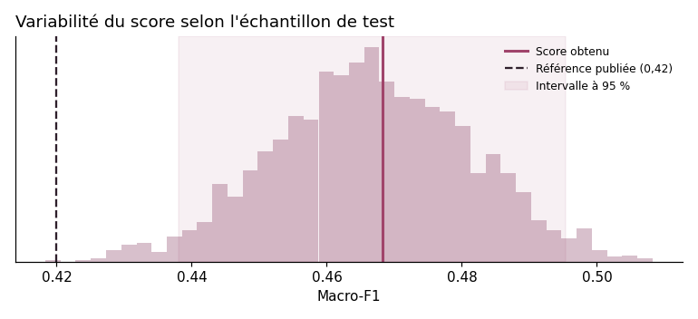
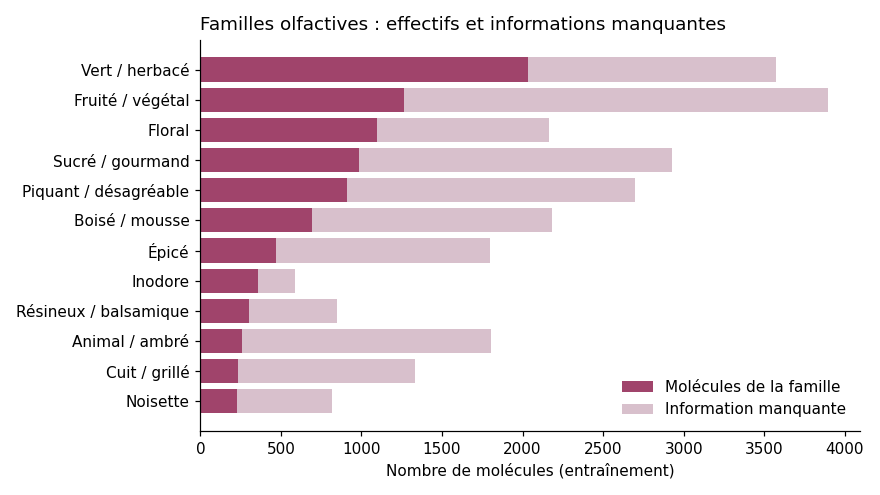
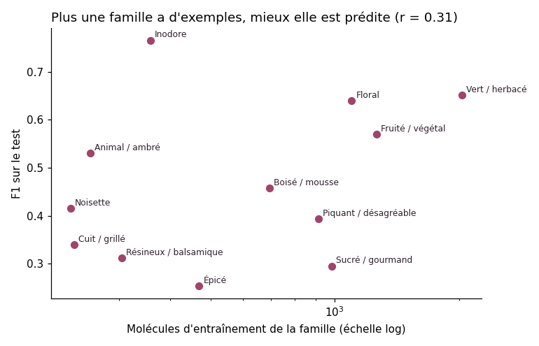

**Prédire le profil olfactif d'une molécule à partir de sa structure chimique, et expliquer pourquoi.**

On choisit une molécule célèbre de la parfumerie (vanilline, hédione, ambroxide…), on tire une molécule que le modèle n'a jamais vue, ou on saisit sa propre structure au format SMILES. L'application affiche sa carte d'identité (formule brute, masse molaire, rôle en parfumerie), puis le modèle estime la probabilité de chacune des 12 familles olfactives (floral, boisé, épicé, gourmand…) et montre les sous-structures chimiques qui ont pesé dans sa décision. Pour la vanilline, par exemple, il retient « sucré / gourmand » et justifie ce choix par la fonction aldéhyde aromatique et le motif gaïacol (méthoxyphénol) : c'est le raisonnement qu'aurait un chimiste formulateur.

Le projet s'appuie sur **OdorNet** (Yang et al., *Scientific Data*, 2 octobre 2026), le plus grand jeu public de molécules à labels olfactifs unifiés, et compare ses résultats à la référence publiée par les auteurs.

## Résultats

Tous les scores sont mesurés sur le **jeu de test officiel** (890 molécules jamais vues). Le découpage est celui des auteurs : il place les stéréoisomères et écritures alternatives d'une même molécule dans un seul ensemble, et le pipeline vérifie à chaque entraînement qu'aucune molécule n'est partagée entre deux ensembles.

| Modèle | Labels manquants | Macro-F1 | Précision | Rappel | PR-AUC |
|---|---|---|---|---|---|
| **XGBoost** | **ignorés (drop)** | **0,468** | 0,448 | 0,517 | **0,451** |
| Random Forest | ignorés (drop) | 0,464 | 0,454 | 0,511 | 0,444 |
| Random Forest | négatifs (intersection) | 0,460 | 0,446 | 0,498 | 0,444 |
| XGBoost | négatifs (intersection) | 0,449 | 0,416 | 0,513 | 0,451 |
| XGBoost | positifs (union) | 0,424 | 0,412 | 0,480 | 0,412 |
| Random Forest | positifs (union) | 0,421 | 0,398 | 0,486 | 0,403 |
| GNN (graphe moléculaire) | ignorés (perte masquée) | 0,406 | 0,367 | 0,495 | 0,360 |
| MLP | ignorés (perte masquée) | 0,395 | 0,359 | 0,477 | 0,361 |
| MLP | négatifs (intersection) | 0,372 | 0,345 | 0,415 | 0,350 |
| MLP | positifs (union) | 0,365 | 0,357 | 0,412 | 0,349 |
| *Référence publiée (Yang et al.)* | | *0,42* | | | |

Le modèle déployé est le XGBoost avec labels manquants ignorés. Il a été choisi sur la **validation**, et non sur le test, pour que le score final reste une estimation honnête. Il est aussi le meilleur toutes approches confondues.

## Ce que les résultats enseignent



**Le score est solide.** Un bootstrap sur le jeu de test (2 000 rééchantillonnages) donne un intervalle de confiance à 95 % de 0,438 à 0,495 pour le macro-F1 : il est entièrement au-dessus de la référence publiée. Le même calcul, apparié, montre en revanche que **XGBoost et la forêt aléatoire sont statistiquement à égalité** (écart compris entre −0,011 et +0,019).

**Les arbres de décision battent les réseaux de neurones.** Sur 6 000 molécules, XGBoost dépasse le GNN de 6 points de macro-F1 et le MLP de 7 points. Les fingerprints de Morgan encodent déjà les voisinages atomiques que le GNN doit apprendre seul, avec peu de données. Le GNN fait tout de même mieux que le MLP : lire la structure en graphe apporte quelque chose, mais pas assez pour rattraper les arbres à cette échelle.

**Ignorer les labels inconnus est la bonne stratégie, pour tous les modèles.** Environ une cellule d'entraînement sur cinq est vide (21 %). Les compter comme positives fait perdre environ 4,5 points de F1, car le modèle apprend des associations fausses. Pour les réseaux de neurones, cette stratégie est implémentée par une perte masquée.

**La validation est optimiste d'environ 10 points.** Les seuils de décision sont réglés sur la validation (0,565), et le score retombe à 0,468 sur le test. C'est un sur-ajustement des seuils au jeu de validation, à garder en tête avant d'annoncer une performance.

**Les performances varient fortement selon la famille.** Le modèle est solide sur « inodore » (F1 0,77), « vert / herbacé » (0,65) et « floral » (0,64). Il reste faible sur « épicé » (0,25), « sucré / gourmand » (0,29) et « résineux / balsamique » (0,31), des familles plus subjectives et moins représentées. L'onglet Performances de l'application détaille précision, rappel et PR-AUC pour chacune.

**La comparaison avec l'article demande de la prudence.** Le 0,468 dépasse le 0,42 publié, sur le même découpage. Mais le protocole exact des auteurs (réglage des seuils, traitement des labels) n'est pas identique, donc il s'agit d'un ordre de grandeur et non d'un classement.

## Analyse des données et des erreurs

Le notebook [`notebooks/analyse.ipynb`](notebooks/analyse.ipynb) détaille l'exploration des données et l'analyse des erreurs. En résumé :



Les familles sont très déséquilibrées (« vert / herbacé » compte près de neuf fois plus de molécules que « noisette ») et une cellule sur cinq est vide. Le F1 d'une famille suit de près son nombre d'exemples (corrélation de 0,82 sur l'échelle logarithmique), à une exception près : « inodore », rare mais très bien prédite.



« Vert / herbacé » est la principale source de confusion : présente aux côtés d'un cinquième à la moitié des molécules des autres familles, elle est ajoutée à tort 186 fois sur le test. Le modèle peine aussi sur les très petites molécules (macro-F1 de 0,29 sous 10 atomes lourds) et confond « inodore » et « piquant / désagréable ». Enfin, le score ne monte que modérément avec la similarité à l'entraînement (0,42 à 0,48, intervalles qui se chevauchent) : l'indicateur de fiabilité de l'application est un repère, pas une garantie.

## Fiabilité des données

Avant tout entraînement, le pipeline vérifie le schéma de chaque fichier (colonnes, nombre de lignes de la version publiée, valeurs 0/1), l'absence de labels manquants en validation et en test, et l'absence de fuite chimique entre les ensembles. Il enregistre aussi l'URL et l'empreinte SHA-256 de chaque CSV dans `data/manifest.json`, reprise dans les métadonnées du modèle : on sait exactement sur quelle version des données il a été entraîné.

## Fiabilité de chaque prédiction

Les scores ci-dessus décrivent le modèle dans son ensemble. Pour chaque molécule analysée, l'application indique en plus si elle ressemble à ce que le modèle a appris : elle cherche la molécule d'entraînement la plus proche (similarité de Tanimoto sur les fingerprints de Morgan) et affiche sa structure et son profil olfactif connu. Une molécule déjà présente à l'entraînement est signalée comme telle ; une molécule très éloignée de toutes les molécules connues est signalée comme une extrapolation peu fiable. C'est ce qu'on appelle le domaine d'applicabilité du modèle. Les seuils utilisés (0,6 et 0,4) sont des repères usuels en chimie computationnelle, pas des garanties.

## Installation et utilisation

Il faut Python 3.11 ou plus récent.

```bash
git clone <url-de-ton-depot> && cd fragrance-ai
python -m venv .venv && source .venv/bin/activate   # Windows : .venv\Scripts\activate
make install          # ou : pip install -r requirements-dev.txt && pip install -e .
```

Le modèle entraîné est fourni dans `models/`, donc l'application fonctionne immédiatement :

```bash
make app              # interface sur http://localhost:8501
make api              # API sur http://localhost:8000/docs
# Analyse : ouvre notebooks/analyse.ipynb dans VS Code et choisis le noyau « fragrance »
make test             # 17 tests (données, anti-fuite, métriques, réseaux, domaine d'applicabilité, API)
```

Pour tout ré-entraîner (environ 20 minutes sur un seul cœur) : `make train`. Les données OdorNet sont téléchargées et contrôlées automatiquement, les 10 expériences sont tracées dans MLflow (`make mlflow` pour les explorer), puis le meilleur modèle à arbres est sauvegardé. Les réseaux de neurones sont écrits avec JAX, qui s'installe en quelques secondes sur CPU sans dépendance GPU.

## Déploiement

**Docker.** `docker compose up --build` lance l'API (port 8000) et l'application (port 8501). L'application interroge alors l'API par le réseau interne de Docker.

**Streamlit Community Cloud (gratuit).** Pousse le dépôt sur GitHub, puis sur share.streamlit.io, choisis le dépôt et le fichier `app/streamlit_app.py`. Sans variable `API_URL`, l'application charge le modèle elle-même.

**Hugging Face Spaces.** Crée un Space de type Docker et pousse le dépôt : le `Dockerfile` est utilisé tel quel.

## Structure

```
src/fragrance_ai/
  config.py      chemins, labels, hyperparamètres
  data.py        téléchargement, contrôle du schéma, anti-fuite, manifeste SHA-256, stratégies de labels
  features.py    217 descripteurs RDKit + fingerprint de Morgan (2048 bits)
  models.py      Random Forest et XGBoost ; un classifieur par famille
  neural.py      MLP et GNN en JAX, avec perte masquée et arrêt anticipé
  evaluate.py    réglage des seuils ; F1, précision, rappel, PR-AUC, AUROC par famille
  train.py       comparaison des 10 configurations, MLflow, sauvegarde
  explain.py     SHAP, avec traduction des bits de Morgan en fragments chimiques
  catalog.py     molécules célèbres, formule brute, masse molaire, molécules surprises du jeu de test
  domain.py      domaine d'applicabilité : molécule d'entraînement la plus proche et niveau de fiabilité
  predict.py     service de prédiction partagé par l'API et l'application
api/main.py      API FastAPI : /health, /model, /predict
app/             interface Streamlit
tests/           tests pytest, exécutés à chaque push par GitHub Actions
docs/ENTRETIEN.md  comment présenter le projet et répondre aux questions d'un recruteur
models/          modèle déployé et ses métadonnées
reports/         tableau comparatif, résultats de l'analyse et figures
notebooks/       analyse exploratoire, analyse des erreurs et marge d'erreur du score
```

## Limites et suite

Les labels proviennent de descriptions humaines collectées dans des sources hétérogènes : une prédiction est une hypothèse à confirmer par l'analyse sensorielle, pas une mesure. Les molécules d'exemple de l'application font partie des données d'entraînement ; la capacité à généraliser se lit dans le tableau de résultats, pas dans ces démonstrations.

Les prochaines étapes sont un GNN pré-entraîné sur de grandes bases de molécules, pour voir si l'apprentissage par transfert rattrape le boosting, une calibration des probabilités, une optimisation des hyperparamètres avec Optuna, et une évaluation sur un découpage par squelette moléculaire (scaffold split), plus exigeant encore.

## Sources et licences

Données : Yang L. *et al.*, « SEA-Driven OdorNet: A Large-Scale Standardized Molecular Olfactory Dataset Based on a Hybrid Semantic Taxonomy », *Scientific Data* (2026), doi:10.1038/s41597-026-08429-z. Les données sont sous licence CC BY 4.0 ; le dépôt officiel est github.com/NKU-DOIE/OdorNet.

Le code de ce projet est sous licence MIT.
